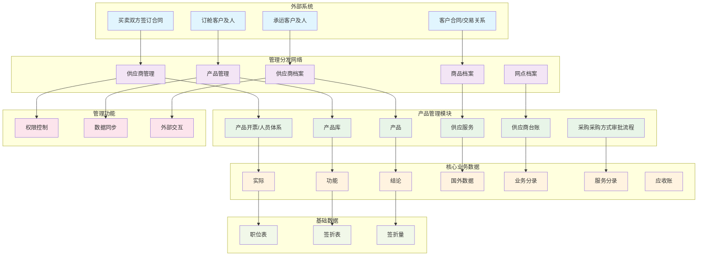
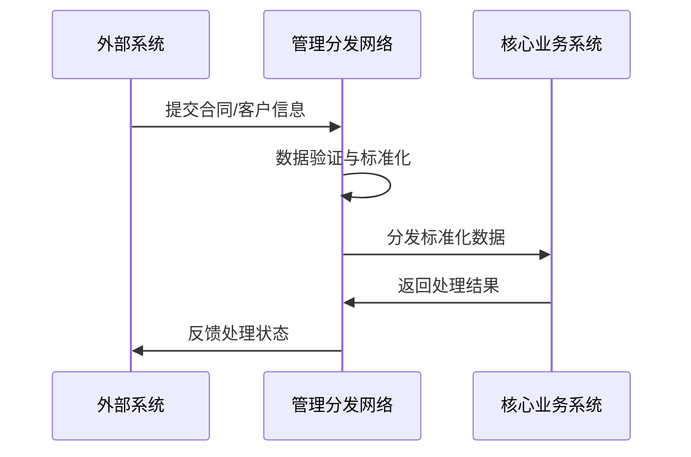
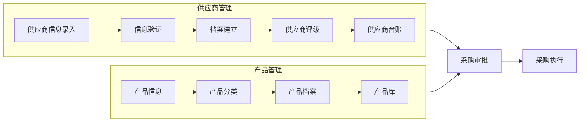
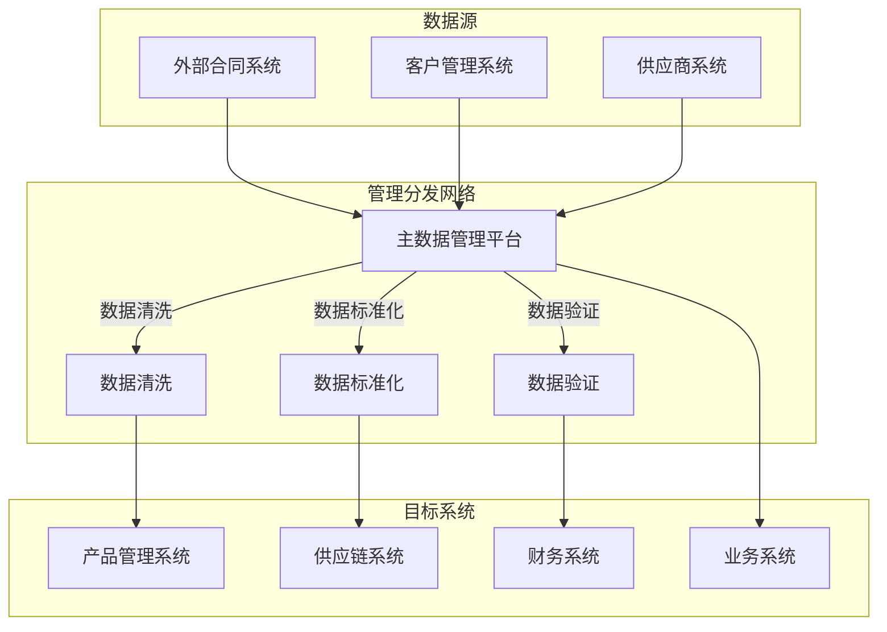
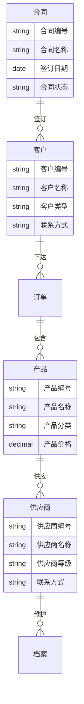

# 主数据管理流程图 - Mermaid格式

## 完整流程图

## 详细子流程

### 1. 外部系统接入流程

### 2. 供应商管理流程

### 3. 数据分发架构

## 关键数据实体

### 核心实体关系图

## 业务规则说明

1. **数据流向规则**：
   - 所有外部数据必须通过管理分发网络进行标准化
   - 核心业务系统不直接与外部系统交互
   - 数据变更需要经过审批流程

2. **权限控制规则**：
   - 不同角色有不同的数据访问权限
   - 关键数据修改需要审批
   - 数据导出需要授权

3. **数据质量规则**：
   - 数据入库前必须进行验证
   - 重复数据自动识别和处理
   - 数据变更全程可追溯
